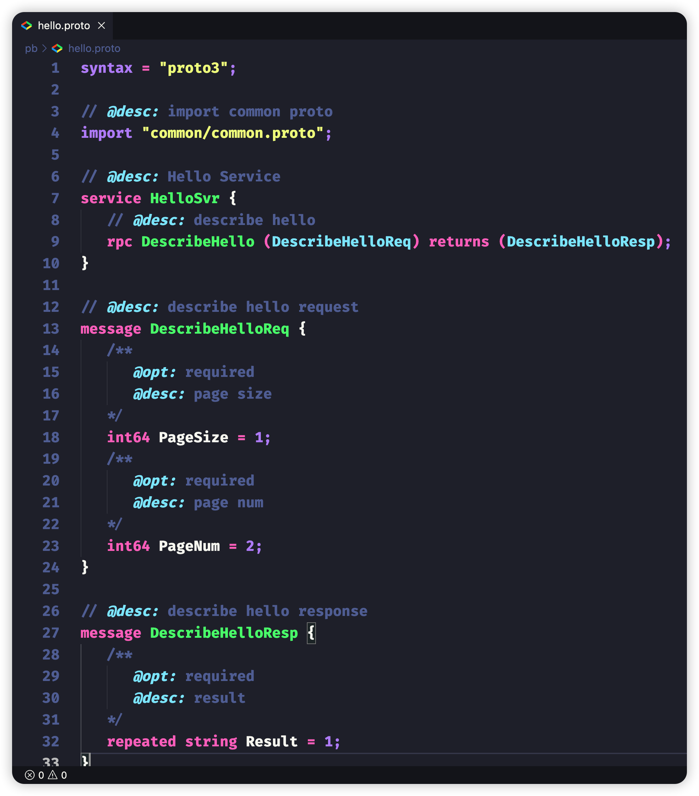

# vscode proto3 tools

    

> proto3 language service

I'm sure you're no stranger to api documentation, but when there's no common place to store it, it can lead to a variety of formats and fragmentation. This causes us to collect the api documentation is so painful. So I wonder why we don't define some important parameters in advance when we write `proto` and stuff the valid data through `comment` form. When we define the api to complete the api documentation, that's great!

## Feature

> More features will come

### Snippets

### Syntaxes

## Todo

- [x] Snippets
- [x] Syntaxes
- [ ] Gen Api Doc

# Acknowledgement

[vscode-proto3](https://github.com/zxh0/vscode-proto3)  
[language_grammars](https://macromates.com/manual/en/language_grammars#naming_conventions)