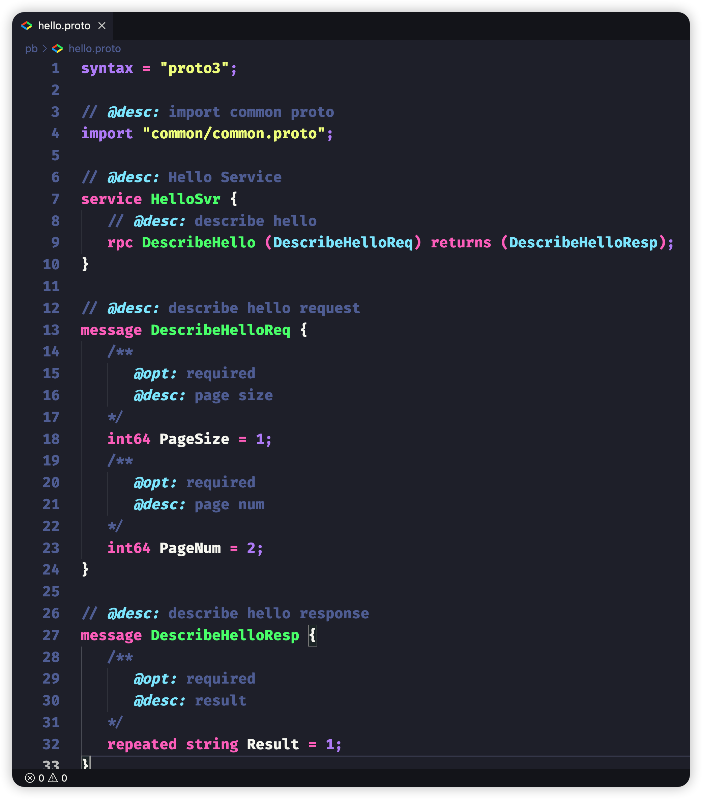
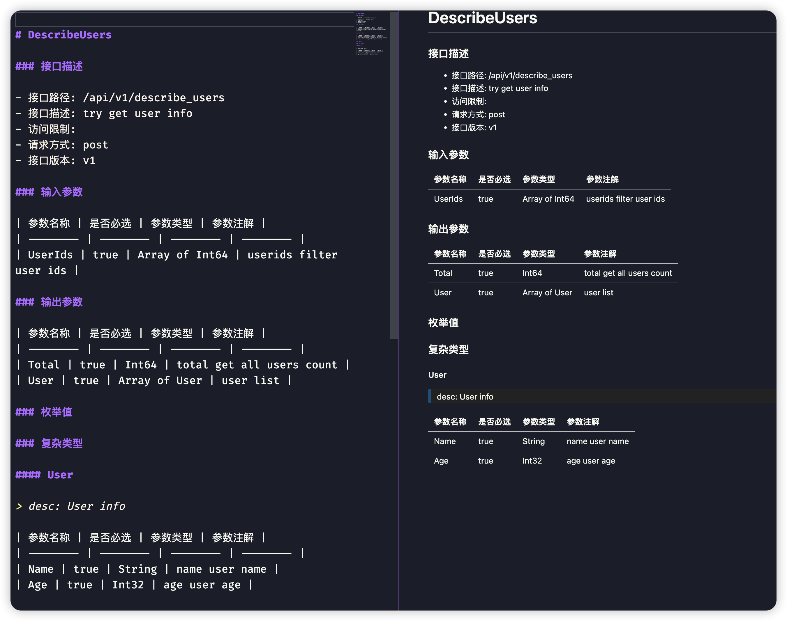
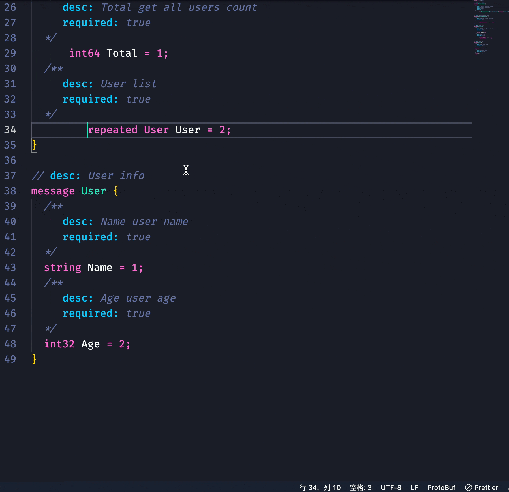

# vscode proto3 tools

    

> proto3 language service

我想接口文档大家肯定不陌生，可是当没有一个公共存储的地方，则会导致我们的接口文档有着各种各样的格式，且是零散的。这导致我们收集接口文档是那么的痛苦。所以在编写 `proto` 时提前用注释等方式把关键信息写清楚，并在需要时一键生成文档，会省事很多；本扩展围绕 **proto3 编辑体验** 和 **与 proto-doc 的衔接** 来做。

## 功能

### 已实现

| 能力 | 说明 |
|------|------|
| **代码片段** | 常见 message / rpc / 字段等模板。 |
| **语法高亮** | `.proto` 的 TextMate 语法（语言 id：`proto3`）。 |
| **生成文档** | 命令与右键菜单调用外部 [**proto-doc**](https://github.com/kalifun/proto-doc)；可配置输出目录与中英模板。 |
| **格式化** | 使用本机 **clang-format**（可在设置里选风格与缩进）。检测结果会缓存，并在配置变化时重新探测；可通过 `proto3.clang-format_executable` 指定可执行路径。 |
| **补全** | 按上下文补关键字、标量类型、当前文件内的 message/enum、常见 `google.protobuf.*`，以及 `rpc` / `returns` 括号内的类型等。 |
| **跳转定义** | 跳转到本文件内的 `message` / `enum` / `service` / `rpc` 定义；支持通过相对路径 `import` 打开的其它 `.proto` 中的同名符号（当前文件优先覆盖 import）。 |
| **CI / 发版** | GitHub Actions：PR/推送时编译 + lint；推送 `v*` 标签时打 VSIX、建 GitHub Release，并在配置 `VSCE_PAT` 时发布到 VS Code 扩展市场。 |

### 代码片段

### 高亮

### 文档

### 格式化

## 尚未实现 / 规划中

- [ ] **AIP / api-linter**：设置里已有 `proto3.disable_rules` 等项，但尚未接入诊断或调用 api-linter。
- [ ] **引用与大纲**：查找所有引用、工作区/文档符号列表等。
- [ ] **复杂 import**：`buf.work.yaml`、`protoc -I` 多根路径等，不仅限于「相对当前文件的 import 路径」。
- [ ] **自动化测试**：在 CI 中跑扩展集成测试。
- [ ] **其它**：Open VSX、语义高亮、更强注释/字符串内解析等。

## Todo 总览

- [x] Snippets  
- [x] Syntaxes  
- [x] Gen Api Doc（proto-doc）  
- [x] Format code  
- [x] clang-format 检测（缓存探测 + 可配置路径）  
- [x] 补全（Completion）  
- [x] 跳转定义（Definition）  
- [x] CI 与 Release 工作流  

# 鸣谢

[vscode-proto3](https://github.com/zxh0/vscode-proto3)  

[language_grammars](https://macromates.com/manual/en/language_grammars#naming_conventions)
