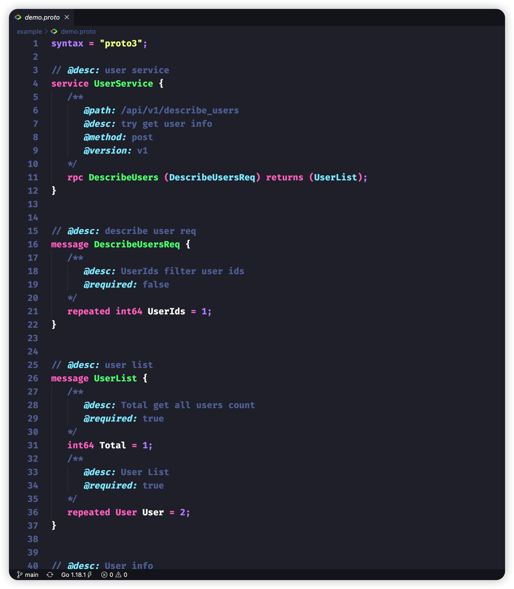

# vscode proto3 tools

    

> proto3 language service

我想接口文档大家肯定不陌生，可是当没有一个公共存储的地方，则会导致我们的接口文档有着各种各样的格式，且是零散的。这导致我们收集接口文档是那么的痛苦。所以我在想我们在编写`proto`的时候为啥不提前将一些重要参数定义好，通过`注释`这种形式将有效数据塞入。当我们在定义接口时就完成了接口文档的编写，那不是妙哉！

## 功能

> 将会有更多功能到来

### 代码片段

### 高亮

## Todo

- [x] Snippets
- [x] Syntaxes
- [ ] Gen Api Doc

# 鸣谢

[vscode-proto3](https://github.com/zxh0/vscode-proto3)  

[language_grammars](https://macromates.com/manual/en/language_grammars#naming_conventions)